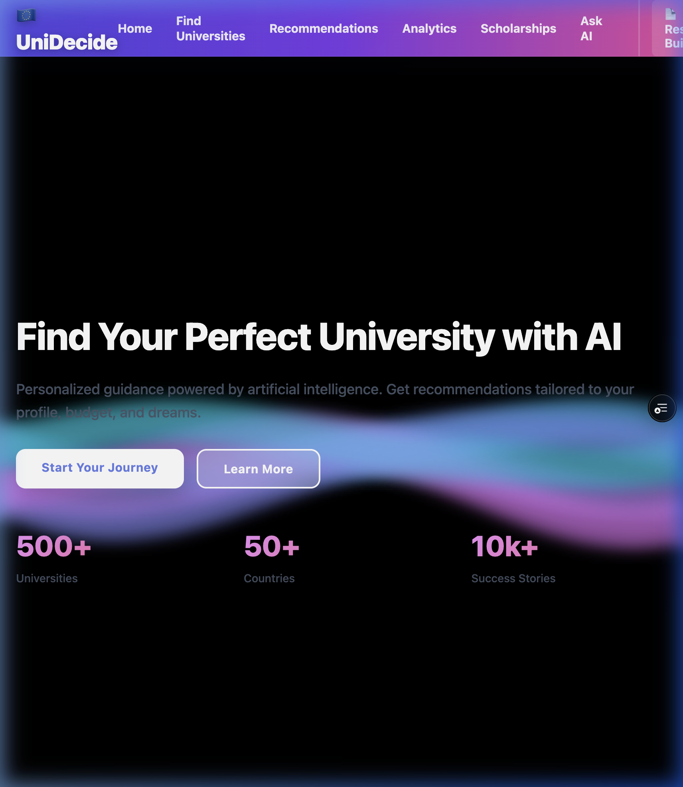

> [!IMPORTANT]
> **Project Status & Vision**
> - **Work in Progress:** This project is currently being refined to be perfectly deliverable for students.
> - **Project Vision:** The [Vercel Real-time Demo](https://ai-european-university-decision-support-system-cxwt7lrh9.vercel.app/) represents the overall vision and conceptual framework of the website.
> - **Commit History Note:** The first **32 commits** represent the core project development and functional logic. All commits following the 32nd are strictly related to documentation, README enhancements, and minor deployment adjustments.

# 🇪🇺 EuroPath AI: Your intelligent guide to Study, SOP, and Visa.


[](https://ai-european-university-decision-support-system-cxwt7lrh9.vercel.app/)
[](https://react.dev/)
[](https://fastapi.tiangolo.com/)
[](https://www.python.org/)

**EuroPath AI** is an intelligent, end-to-end platform designed to help international students navigate the entire journey of studying in Europe—from initial university selection to landing your student visa dream.

> [!NOTE]
> This project is optimized for performance and privacy. All user-specific documentation is stored locally to ensure data security.

---



## ✨ Key Features

### 🔍 1. AI University Recommender
- **Smart Profile Matching**: Input your GPA, IELTS, and Budget to get a ranked list of universities.
- **Admission Probability**: Real-time calculation of your chances (🔴 LOW, 🟡 MEDIUM, 🟢 HIGH) with detailed feedback.
- **Cost & ROI Analytics**: Visual dashboards comparing tuition vs. ranking and future career ROI.

### 📝 2. AI Resume Builder (Europass Style)
- **Completeness Meter**: Interactive progress tracking to ensure your CV meets professional European standards.
- **✨ AI Summary Generator**: One-click professional bio generation tailored to your unique academic and work background.
- **Modern & Classic Templates**: Switch between traditional Europass and contemporary professional layouts.
- **CEFR Language Grid**: Expert-level language proficiency self-assessment (Listening, Reading, Speaking, Writing).

### 🖋️ 3. AI SOP & Motivation Letter Assistant
- **Tailored Letters**: Generate personalized Statement of Purpose (SOP) based on your target university requirements.
- **Tone Selection**: Customize your application with **Professional**, **Academic**, or **Enthusiastic** styles.
- **Live Preview**: Review your letter in a classic academic typeface before downloading as a file.

### 🛂 4. Interactive Visa Tracker
- **Country-Specific Intelligence**: Specialized student visa checklists for **Germany**, **France**, **Italy**, and **Spain**.
- **Blocked Account Helper**: Clear guidance on financial requirements (e.g., German Sperrkonto calculations).
- **Progress Persistence**: Your checklist status is saved automatically, allowing you to track your visa progress over time.

### 🏠 5. Relocation Guide
- **City-Specific Roadmap**: Intelligent guides for housing (WG-Gesucht), bank accounts, and registration (Anmeldung/CAF) once admitted.

### 🤖 6. Ask AI Assistant
- An interactive chatbot to answer complex questions about European universities, local living costs, and scholarships.

---

## 🛠️ Tech Stack

| Layer | Technologies |
| :--- | :--- |
| **Frontend** | React 18, Axios, CSS Modules, Chart.js, Framer Motion |
| **Backend** | FastAPI (Python 3.9+), Pydantic, Pandas, SQLAlchemy |
| **Data Engine** | Multi-dimensional Rule Engine & ML-based Probability Models |
| **Persistence** | SessionStorage & LocalStorage for high-privacy data management |

---

## 🚀 Getting Started Locally

### 1. Backend Setup (Port 8000)
```bash
cd backend
python -m venv venv
source venv/bin/activate  # On Windows: venv\Scripts\activate
pip install -r requirements.txt
uvicorn app:app --reload
```

### 2. Frontend Setup (Port 3000)
```bash
cd frontend
npm install
npm start
```

---

## 📁 Architecture

- **`backend/routes/`**: Modularized API services for Relocation, Resume, SOP, Visa, and Recommendations.
- **`frontend/src/pages/`**: Premium, responsive React views for each specialized tool.
- **`frontend/src/components/`**: Reusable UI components including the new Relocation roadmap.

---

## 🌟 Our Mission
Applying for higher education abroad is a life-changing but high-stress process. **EuroPath AI** aims to replace dozens of messy spreadsheets and confusing embassy websites with a single, AI-guided dashboard that makes the "European Dream" organized, data-driven, and accessible to everyone.

---
*Created with ❤️ for future international scholars.*

